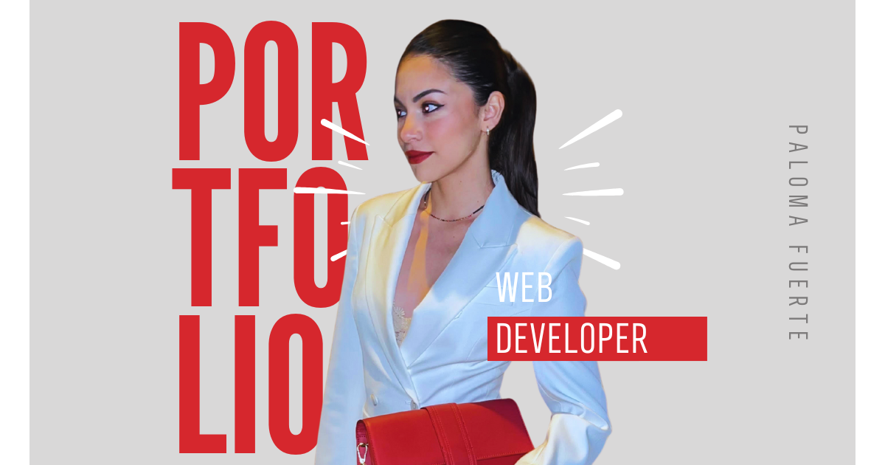

# Paloma Fuerte - Portfolio Web Developer




## Descrizione del progetto

Questo progetto è un portfolio personale di **Paloma Fuerte**, sviluppatrice web junior.
Include tre pagine principali:

- **Home (index.html):** presentazione personale con bio, competenze e alcuni progetti.
- **Curriculum Vitae (cv.html):** dettagli sul profilo, esperienza, formazione e competenze.
- **Contattami (contattami.html):** modulo di contatto funzionante tramite EmailJS.
  Il progetto è progettato con un design moderno, responsive e interattivo, con colori scuri e elementi visivi coerenti.

## Tecnologie utilizzate

- **HTML** e **CSS**
- **SASS/SCSS** per gestione avanzata degli stili
- **Bootstrap 5** per layout e componenti responsive
- **JavaScript** soltanto per modulo contatti
- **EmailJS** per l'invio di messaggi dal form di contatto
- Grafica e immagini create con **Canva**

## Istruzioni per eseguire il progetto localmente

1. Clona il repository sul tuo computer:

```bash
  git clone https://github.com/PalomaFuerte/Progetto-HTML-e-CSS-di-Miriam-Paloma-Fuerte-Contreras.git
```

2. Apri la cartella del progetto.
3. Apri uno dei file HTML (index.html, cv.html o contattami.html) con un browser moderno (Chrome, Firefox, Edge, Safari).
4. Per testare il modulo di contatto, assicurati di avere una connessione internet attiva, dato che utilizza EmailJS per l'invio dei messaggi.

In alternativa, puoi visualizzare il progetto direttamente online tramite GitHub Pages:
[Portfolio di Paloma Fuerte](https://PalomaFuerte.github.io/Progetto-HTML-e-CSS-di-Miriam-Paloma-Fuerte-Contreras/)

## Contatti

Puoi contattarmi attraverso i seguenti canali:
Puoi contattarmi attraverso i seguenti canali:

**Email:** lefortbyfuerte@gmail.com
**GitHub:** [Paloma Fuerte](https://github.com/PalomaFuerte)
**LinkedIn:** [Paloma Fuerte](https://www.linkedin.com/in/paloma-fuerte-073160242/)
**Instagram:** [Paloma Fuerte](https://www.instagram.com/fuertepaloma)
